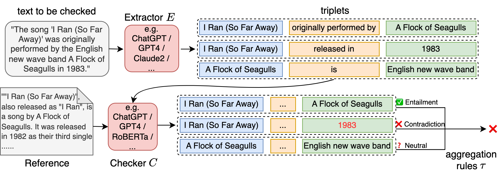
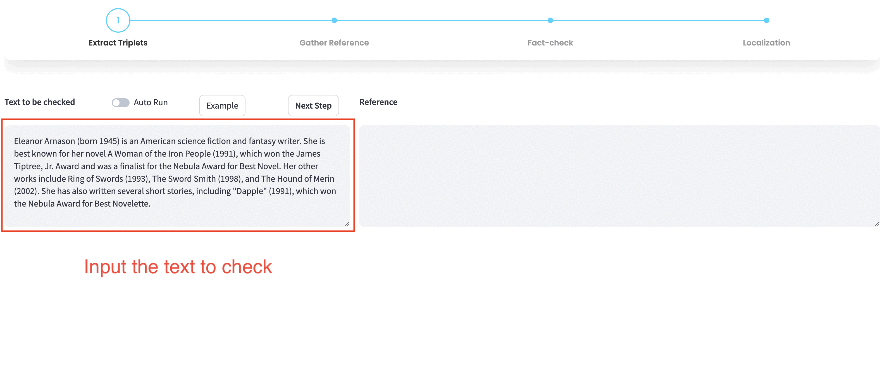
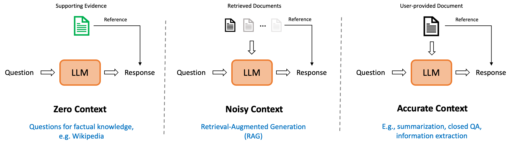
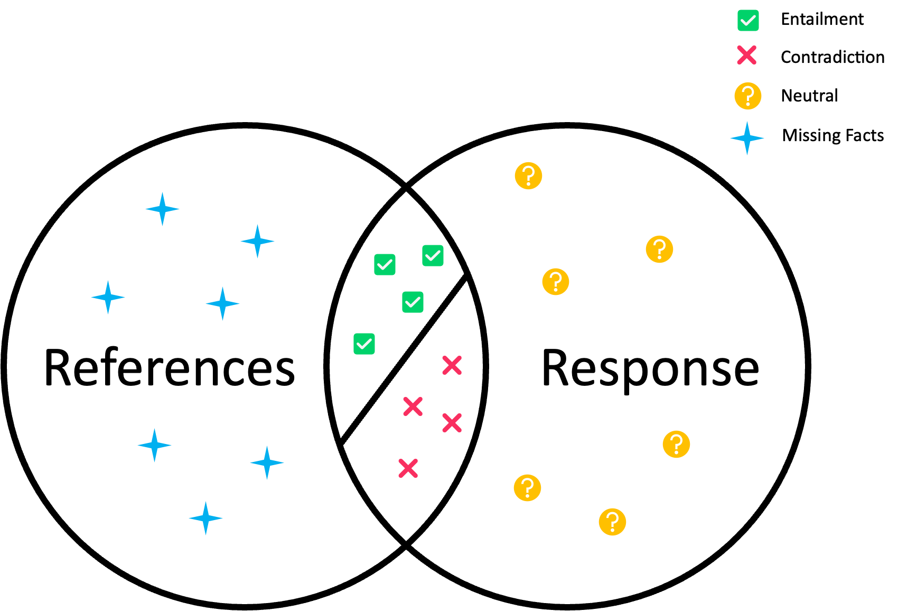
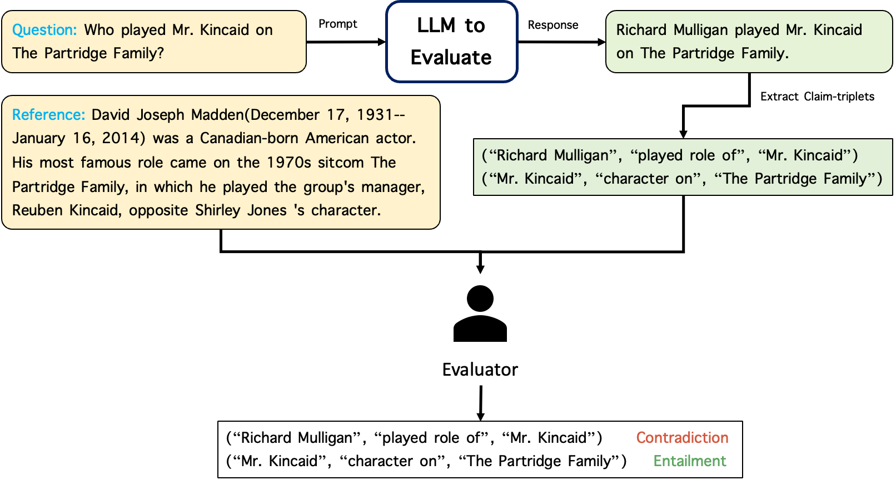
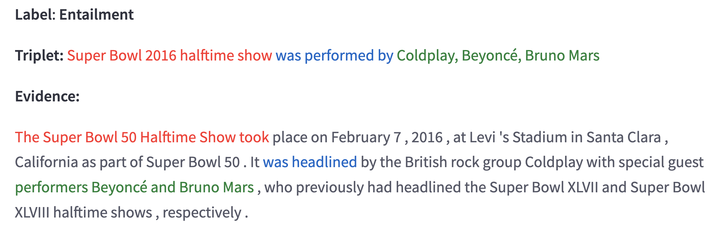
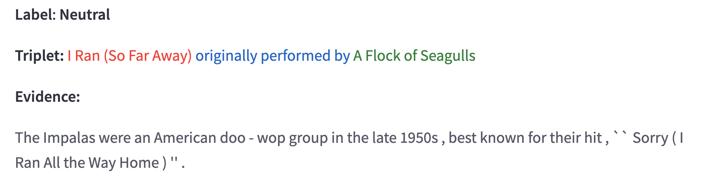
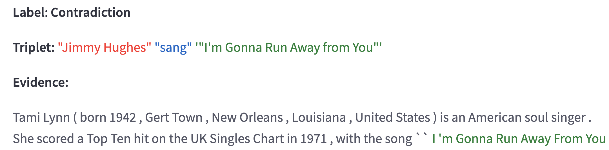
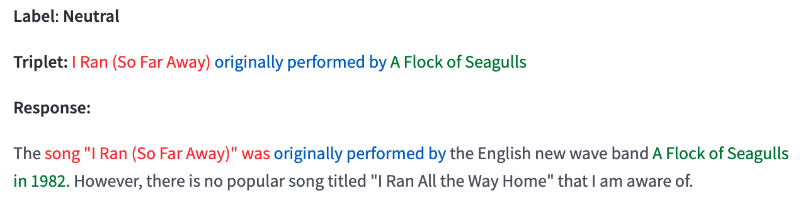

# RefChecker for Fine-grained Hallucination Detection
| **[🔥 News](#news)** |
**[🤖️ Demo](#demo_website)** |
**[🚀 Quick Start](#quick_start)** |
**[💾 Benchmark](#benchmark_dataset)** |
**[📖 Docs](#documentation)** |

RefChecker provides a standardized assessment framework to identify subtle hallucinations present in the outputs of large language models (LLMs). 
<p align="center">
  
  <br>
  <b>Figure</b>: RefChecker Framework
</p>

## 🌟 Highlighted Features

- **Finer granularity** - RefChecker breakdowns the claims in the LLM’s response into [knowledge triplets](#granularity), as opposed to paragraph, sentence or sub-sentence. Detecting at knowledge triplets will test the truthfulness of facts. Importantly, this finer granularity subsumes other coarse granularity and is therefore more informative and precise. One can arbitrarily roll up the granularity ladder to derive coarse level metrics if needed.
- **Wider Coverage** - RefChecker differentiates [three distinctive settings](#setting_definitions) based on the quality and quantity of context provided for LLM’s response:
    1. Zero Context: the prompt is a factual question without any context (eg. Open QA).
    2. Noisy Context: the prompt is a question as well as a list of retrieved document (eg. RAG).
    3. Accurate Context: the prompt is a question as well as one document (eg. Summarization).
- **Human Evaluation** - RefChecker includes 2.1k [human annotated LLM’s responses](#benchmark_dataset) consist of 300 test samples, each responded by 7 popular LLMs: GPT4, GPT-3.5-Turbo, InstructGPT, Falcon (Falcon-40B-Instruct), Alpaca (Alpaca-7B), LLaMA2(70B-Chat) and Claude 2. We will release the data and results upon approval.
- **Modular Architecture** — RefChecker is a 3-stage pipeline, consisting of a [claim extractor](#extraction) $E$, a [hallucination checker](#checking) $C$, and [aggregation rules](#aggregation) $\tau$. They can be invoked and configured individually from command-line. Other than the 3 core stages, there are 3 auxiliary components:
    1. human labeling tool (coming soon) to label claims,
    2. call to search engine for Zero Context setting
    3. a [localization model](#localization) to map each knowledge triple back to the corresponding snippets of the reference.

You can explore RefChecker in the following ways:

- **[Demo Website](#demo_website)** - Setup a website and check your responses with user interfaces. 
- **[Quick Start](#quick_start)** - Setup the environment and check your responses in a console.
- **[Automatic Checker](#automatic-hallucination-checker)** - Check our automatic hallucination checker with strong performance and efficiency.

<a id='news'></a>
## 🔥 News
- [07/22/2024] Add support for joint checking the claims for better checking efficency.
- [06/24/2024] RefChecker supports most of the LLMs by employing litellm and vllm.
- [05/23/2024] RefChecker paper is on Arxiv: https://arxiv.org/pdf/2405.14486 
- [12/07/2023] RefChecker 0.1 release.

## ❤️ Citation
Please check out the paper here: https://arxiv.org/pdf/2405.14486 

If you use RefChecker in your work, please cite us:
```bibtex
@article{hu2024refchecker,
      title={RefChecker: Reference-based Fine-grained Hallucination Checker and Benchmark for Large Language Models}, 
      author={Xiangkun Hu and Dongyu Ru and Lin Qiu and Qipeng Guo and Tianhang Zhang and Yang Xu and Yun Luo and Pengfei Liu and Yue Zhang and Zheng Zhang},
      year={2024},
      eprint={2405.14486},
      archivePrefix={arXiv},
      primaryClass={cs.CL}
}
```
<a id='demo_website'></a>
## 🤖️ Demo Website


You can first setup a [demo website](./demo/) and then use the web UI to try RefChecker as the animation shows above. There are four steps to perform hallucination detection in it:

1. **Extract Triplets**: You can start with typing what you want to check in the top-left box. Then click the `Next Step` button on the right side. The checker will extract triplets in your text and show them in the bottom-left area.
2. **Gather Reference**: You can then add reference text in the top-right box and click the `Next Step` button. If you don’t have reference text, leave the box empty and click the button anyway. We will retrieve some references with the text to be checked using search engines.
3. **Fact Checking**: With the text to be checked and the retrieved reference text, the checker will perform fact checking then. The checking results will be shown in the bottom-left area, with ✅/❌/❓ indicating factual/hallucinatory/neutral. An overall factuality score will be given aside.
4. **Localization**: You can then click the `Next Step` button and the checker will perform triplet localization. You can click the button on the left of each triplet to see the localization result.


<a id='quick_start'></a>

## 🚀 Quick Start

### Setup Environment
First create a python environment using conda or virtualenv. Then install:
```bash
pip install refchecker
python -m spacy download en_core_web_sm
```

Install optional dependencies to use open source extractors (Mistral, Mixtral) or enable acceleration for RepCChecker.
```bash
pip install refchecker[open-extractor,repcex]
```

### Code Examples

#### Choose Models for the Extractor and Checker

We use [litellm](https://docs.litellm.ai/) as to invoke the LLMs. Please check the document for how to setup the model for different LLM providers: https://docs.litellm.ai/docs/providers . We give some examples below:


- Amazon Bedrock

# Setup the enviroment variables if you are not using AWS EC2 instance
# If you are using AWS EC2, make sure your region has the access to the model
```bash
export AWS_ACCESS_KEY_ID=<your_aws_access_key_id>
export AWS_SECRET_ACCESS_KEY=<your_aws_secret_access_key>
export AWS_REGION_NAME=<your_aws_region_name>
```


```python
import os
from refchecker import LLMExtractor, LLMChecker

# Claude 3 Sonnet from Amazon Bedrock
model = 'bedrock/anthropic.claude-3-sonnet-20240229-v1:0'

extractor = LLMExtractor(model=model, batch_size=8)
checker = LLMChecker(model=model, batch_size=8)
```

You can also setup the enviroment variables in terminal to avoid disclosing these information in the code:
```bash
export AWS_ACCESS_KEY_ID=<your_aws_access_key_id>
export AWS_SECRET_ACCESS_KEY=<your_aws_secret_access_key>
export AWS_REGION_NAME=<your_aws_region_name>
```

- OpenAI

```python
import os
from refchecker import LLMExtractor, LLMChecker


os.environ["OPENAI_API_KEY"] = "<your_openai_api_key>"

# GPT-4o from OpenAI
model = 'gpt-4o'

extractor = LLMExtractor(model=model, batch_size=8)
checker = LLMChecker(model=model, batch_size=8)
```

- Open source LLMs

Please use [vllm](https://github.com/vllm-project/vllm) to setup the API server for open source LLMs. For example, use the following command to deploy a Llama 3 8B hosted on HuggingFace:

```bash
python -m vllm.entrypoints.openai.api_server \
  --model meta-llama/Meta-Llama-3-8B-Instruct \
  --tensor-parallel-size 8 \
  --dtype auto \
  --api-key sk-123456789 \
  --gpu-memory-utilization 0.9 \
  --port 5000
```

Setup the api key:

```bash
export OPENAI_API_KEY=sk-123456789
```

Then we can initilize the extractor and checker with `api_base`:

```python
import os
from refchecker import LLMExtractor, LLMChecker


# Note the prefix "openai/" here
model = "openai/meta-llama/Meta-Llama-3-8B-Instruct"
api_base = "http://0.0.0.0:5000/v1"
extractor = LLMExtractor(model=model, batch_size=8, api_base=api_base)
checker = LLMChecker(model=model, batch_size=8, api_base=api_base)
```

- Fine-tuned Mistral 7B Claim Extractor

We fine-tuned a Mistral 7B model for claim extraction. Deploy it with vllm:

```bash
python -m vllm.entrypoints.openai.api_server \
  --model dongyru/Mistral-7B-Claim-Extractor \
  --tensor-parallel-size 8 \
  --dtype auto \
  --api-key sk-123456789 \
  --gpu-memory-utilization 0.9 \
  --port 5000
```

Then we can initilize the extractor as follows:
```python
extractor = LLMExtractor(
  model="openai/dongyru/Mistral-7B-Claim-Extractor", 
  batch_size=8, 
  api_base="http://0.0.0.0:5000/v1"
)
```

- Non-LLM based Checkers

We also offer non-LLM checker for efficent checking:

```python
from refchecker import AlignScoreChecker, NLIChecker


# Details see paper: https://arxiv.org/abs/2305.16739
checker = AlignScoreChecker(device=0, batch_size=128)

# See https://huggingface.co/ynie/roberta-large-snli_mnli_fever_anli_R1_R2_R3-nli
checker = NLIChecker(device=0, batch_size=128)
```

#### Run Extraction and Checking

Both the extractor and checker takes a batch of inputs:

```python
# Batch of questions (optional)
questions = ['question 1', 'question 2']
# Batch of model responses
responses = ['response 1', 'response 2']

extraction_results = extractor.extract(
    batch_responses=responses,
    batch_questions=questions,
    max_new_tokens=1000
)

batch_claims = [[c.content for c in res.claims] for  res in extraction_results]

references = ['reference 1', 'reference 2']
batch_labels = checker.check(
    batch_claims=batch_claims,
    batch_references=references,
    max_reference_segment_length=0
)
```

The `extraction_results` is a list of `RCClaim` objects defined in [refchecker/base.py](refchecker/base.py).


### Command Line Interface

We provide a command-line interface to run RefChecker in a console:

```
usage: refchecker-cli [-h] --input_path INPUT_PATH --output_path OUTPUT_PATH
                     [--cache_dir CACHE_DIR]
                     [--extractor_name EXTRACTOR_NAME]
                     [--extractor_max_new_tokens EXTRACTOR_MAX_NEW_TOKENS]
                     [--claim_format {triplet, subsentence}]
                     [--checker_name CHECKER_NAME]
                     [--extractor_api_base EXTRACTOR_API_BASE]
                     [--checker_api_base CHECKER_API_BASE]
                     [--repc_classifier_name {svm,svm_ensemble,nn,nn_ensemble}]
                     [--retriever_name {google}]
                     [--aggregator_name {strict,soft,major}]
                     [--use_retrieval]
                     [--batch_size_extractor BATCH_SIZE_EXTRACTOR]
                     [--batch_size_checker BATCH_SIZE_CHECKER]
                     [{extract,check,extract-check}]

positional arguments:
  {extract,check,extract-check}
     extract:       Extract claims from provided responses.
     check:         Check whether the provided claims are factual.
     extract-check: Extract claims and check whether they are factual.

options:
  -h, --help  show this help message and exit
  --input_path INPUT_PATH
              Input path to the json file.
  --output_path OUTPUT_PATH
              Output path to the result json file.
  --cache_dir CACHE_DIR
              Path to the cache directory. Default: ./.cache.
  --extractor_name EXTRACTOR_NAME
              Model used for extracting claims. Default: bedrock/anthropic.claude-3-sonnet-20240229-v1:0
  --extractor_max_new_tokens EXTRACTOR_MAX_NEW_TOKENS
              Max generated tokens of the extractor, set a larger value for longer documents. Default: 500
  --claim_format {triplet, subsentence}
              The format of the extracted claims. Default: triplet
  --checker_name CHECKER_NAME
              Model used for checking whether the claims are factual. Default: bedrock/anthropic.claude-3-sonnet-20240229-v1:0
  --extractor_api_base EXTRACTOR_API_BASE
              API base URL if using vllm for deploying the extractor.
  --checker_api_base CHECKER_API_BASE
              API base URL if using vllm for deploying the checker
  --repc_classifier_name {svm,svm_ensemble,nn,nn_ensemble}
              Classifier Model used for RepC checker, only valid when RepC checker is used.
              Default: nn_ensemble, neural network classifier with layer ensemble.
  --retriever_name {google}
              Model used for retrieving reference (currently only google is supported).
              Default: google.
  --aggregator_name {strict,soft,major}
              Aggregator used for aggregating the results from multiple triplets.
              Default: soft.
              *  strict: If any of the triplets is Contradiction, the response is
              Contradiction. If all of the triplets are Entailment, the response is
              Entailment. Otherwise, the response is Neutral.
              *  soft:   The ratio of each category is calculated.
              *  major:  The category with the most votes is selected.
  --use_retriever  
              Whether to use retrieval to find the reference for checking. Required
              if the reference field in input data is not provided.
  --serper_api_key SERPER_API_KEY
              Path to the serper api key file. Required if the google retriever is
              used.
  --batch_size_extractor BATCH_SIZE_EXTRACTOR
              Batch size for batching inference of eatractor. Default: 16.
  --batch_size_checker BATCH_SIZE_CHECKER
              Batch size for batching inference of checker. Default: 16.
```

To extract claim triplets from LLM-generated responses, do:
```bash
refchecker-cli extract \
  --input_path {INPUT_PATH} \
  --output_path {OUTPUT_PATH} \
  --extractor_name {EXTRACTOR_NAME} \
  --extractor_api_base {EXTRACTOR_API_BASE}
```

The input json file contains a list of
```json
{
   "response": "",  # required, the response to be checked
   "question": "",  # optional if the question is not important (e.g., in summarization)
   "reference": "", # required, the reference for checking
   ...
}
```

In the output json file, each item is added with a `claims` field, containing a list of `[head, relation, tail]`.

To check hallucinations at triplet level, do:
```bash
refchecker-cli check \
  --input_path {INPUT_PATH} \
  --output_path {OUTPUT_PATH} \
  --checker_name {CHECKER_NAME} \
  --checker_api_base {CHECKER_API_BASE} \
  --aggregator_name {strict,soft,major}
```

The input json file contains a list of
```json
{
   "response": "",  # required, the response to be checked
   "claims": [
       ["head1", "relation1", "tail1"],
       ["head2", "relation2", "tail2"],
       ...
   ]                # required, the corresponding triplets of the response
   "reference": "", # optional if a retriever is used to get reference
   ...
}
```

In the output json file, each item is added with the following fields:
```json
{
   "Y": Union[str, dict],  # aggregated predictions on the whole response
   "ys": [
       "Entailment",
       "Neutral",
       "Contradiction",
       ...
   ]                # checker predictions on each triplet
   "reference": "", # added if a retriever is used to get reference
   ...
}
```

The format of aggregated predictions `Y` depends on the selected aggregator. It is a `str` as “Entailment”, “Neutral”, or “Contradiction” if `strict` or `major` aggregators are used. It is a `dict` containing ratios of each category if the `soft` aggregator is used. We additionally include a special category “Abstain” introduced in [Evaluation Metric](#evaluation-metric).

Note that the retriever is required in the zero-context setting, where no reference is provided by users. You can activate it by adding the `--use_retriever` flag and specifying `--retriever_name`. Currently we only support a google-based retriever. Feel free to try your own retrieval system and welcome to contribute.

For using the google retriever and/or the OpenAI models, you should provide corresponding API keys by specifying `--serper_api_key` and/or `--openai_key`.

Finally, you can use the whole extraction and checking pipeline by:
```bash
refchecker-cli extract-check \
  --input_path {INPUT_PATH} \
  --output_path {OUTPUT_PATH} \
  --extractor_name {EXTRACTOR_NAME} \
  --checker_name {CHECKER_NAME} \
  --extractor_api_base {EXTRACTOR_API_BASE} \
  --checker_api_base {CHECKER_API_BASE} \
  --aggregator_name {strict,soft,major} \
  <other optional flags>
```

You can try the command-line with example scripts and example input data [here](./example/).

<a id='documentation'></a>

## 📖 Our Approach for Fine-grained Hallucination Detection

LLMs exhibit a susceptibility to generate hallucinated contents that can be challenging to discern, possibly leading users astray. To address this, this project centers on the construction of a standardized assessment framework aimed at identifying such hallucinations present in the outputs of LLMs. Specifically, we try to answer the the following questions:

* How to define hallucinations?
* How to represent and extract the claims?
* How to check hallucinations?
* How to benchmark LLMs on hallucinations?

**Table of Contents**
- [A Taxonomy of Hallucination](#a-taxonomy-of-hallucination)
- [Benchmark Dataset](#benchmark-dataset)
- [Automatic Hallucination Checker](#automatic-hallucination-checker)
- [Limitations and Call for Contributions](#limitations-and-call-for-contributions)


### A Taxonomy of Hallucination

Hallucinations are claims made by LLMs not supported by factual knowledge, which we refer to as references; detecting hallucinations involves comparing the claims against the references. This process depends on tasks, contexts, granularity of checking and how we categorize them. We will discuss them in turn.

<a id='setting_definitions'></a>

#### Context, Tasks and References

When LLM generates a response, there is a great deal of variations as how contexts are provided which, in turn, determines where and how to identify the reference:

- **Zero Context**: Users can ask the questions directly and the there is no access to any external knowledge sources, as often seen in chitchat conversations. In this case, LLMs rely on their own knowledge learned during pre-training, we call this scenario as *Zero Context*. Detecting hallucinations in Zero Context setting is challenging due to the lack of references. To ease the problem, our benchmark collects questions from Closed Book QA dataset that have human annotated references; we believe these data would have already been included in LLM’s training corpus. If RefChecker is deployed on new samples in this setting and the user lacks references, we activate the Google search API to find webpages that can serve as references. A more principled approach is to retrieve references from the training corpus; this remains a research topic. 
- **Noisy Context**: In certain use cases, the references are provided in the prompt to ground the answer to external knowledge sources. This can be achieved through internet searches (e.g. New Bing) with the query or by retrieving from vertical domain data. This user scenario is typically known as Retrieval-Augmented Generation (RAG) in the literature. The retrieval step of this setting may introduce noisy content to the model and, for this reason, we term this setting as *Noisy Context*.
- **Accurate Context**: There are some tasks about understanding or rewriting of a given document, such as closed-book question answering (QA), summarization or text rewritten as commonly seen in instruction-tuning tasks. We call this type of task as *Accurate Context*. 

For both Noisy Context and Accurate Context tasks, we take the documents in the prompt as the references. The following figure illustrate the differences of the three settings. 


<p align="center">Illustration of three settings of context, tasks and references.</p>


#### Definition of Hallucination and Granularity of Checking

Hallucination detection is challenging because non-factualness often creeps in and corrupts parts of a response subtly. Rather than declaring the entire response as hallucinatory or not, in this work we inspect claims that are embedded in a response. With that, the basic relationship between a response and its corresponding references can be visualized as a Venn diagram shown below.

- The intersections between response and reference claims are those that can be directly verified, and they fall either as **Entailment** (green check mark) or **Contradiction** (red crosses), depending on whether they are supported or refuted by the references. 
- However, in practical applications, the references may not always provide sufficient evidence to verify all claims. In such cases, the truthfulness of these claims requires additional evidence for assessment (orange question marks); we refer to such claims as **Neutral**. 

These three categories align closely with the concepts of `support`, `refute`, and `not enough information` within the fact-checking literature, and they are commonly used in Natural Language Inference (NLI). 


<p align="center"></p>
<p align="center">Definition of Hallucinations.</p>


Moving on, the remaining claims, represented by blue stars, contain information that is not addressed in the response. Whether this information should be incorporated into the response depends on the specific task at hand. In tasks like machine translation, omitting this information can result in a loss of information and should be considered a form of hallucination. In this release, we concentrate on question answering (QA) tasks, as well as text summarization and information extraction. In these tasks, missing facts are not regarded as hallucinations, their relevance may or may not be important. For example, in QA tasks the missing claims reflect retrieval quality instead; we leave this for future work.

<a id='granularity'></a>

**The Granularity of Claim**

Informally, claims are the unit for the checking. Previous works use sentences in the response as claims ([SelfCheckGPT](https://arxiv.org/abs/2303.08896)), or generate short phrases (i.e. sub-sentences) as the claims produced by LLM’s in-context learning ([FActScore](https://arxiv.org/abs/2305.14251), [FACTOOL](https://arxiv.org/abs/2307.13528)). This work explores the approach of representing claims with knowledge triplets. This concept is inspired by the field of knowledge graph studies, where triplets are employed to encapsulate factual knowledge units. Knowledge triplets adopt a `(subject, predicate, object)` structure to capture fine-grained information within the response. We call the triplet represented claims as Claim-Triplets. Here is an example of model response and the claim-triplets extracted by Claude 2 (see [Triplet Extraction](#triplet-extraction) for the details of claim-triplet extraction):

> Richard Mulligan played Mr. Kincaid on The Partridge Family.

| Subject | Predicate | Object |
| --- | --- | --- |
| Richard Mulligan | played | Mr. Kincaid |
| Mr. Kincaid | chracter in | The Partridge Family |


<a id='benchmark_dataset'></a>

### Benchmark Dataset
We have assembled a benchmark dataset comprising 300 examples, with 100 examples for each of the three settings mentioned earlier. The examples are randomly sampled from the data sources listed in the following table:

| Setting | Data Source | Task | References |
| --- | --- | --- | --- |
| Zero Context | NaturalQuestions (dev set) | Closed Book QA | Annotated Long Answer |
| Noisy Context | MS MARCO (dev set) | RAG | Retrieved Passages |
| Accurate Context | databricks-dolly-15k | Summarization, Closed QA, Information Extraction | Input Context |

We collect responses from 7 LLMs on the benchmark: GPT4, GPT-3.5-Turbo, InstructGPT, Falcon (Falcon-40B-Instruct), Alpaca (Alpaca-7B), LLaMA2(70B-Chat) and Claude 2. The code and examples for response collection can be found in [response_collection](./response_collection/).

We performed a human evaluation of responses generated by seven LLMs on this benchmark dataset. The process is shown in the figure below which involved three steps: gathering responses, extracting claim-triplets, and asking human annotators to evaluate these claims. 23% of the claim-triplets were double annotated, with 95.0% Inter-Annotator Agreement. We employ Claude 2 for the claim-triplet extraction for human evaluations, but it can be replaced with any triplet extraction model. During the annotation, we also ask the annotators to mark low quality triplets. These identified low quality triplets are then removed from the benchmark dataset. We will release the data and results upon approval.


<p align="center">The evaluation process under the Zero Context setting as an example.</p>


### Evaluation Metric
We evaluate using the frequency of each hallucination label. For example, if there are 3 Entailment, 5 Neutral, and 2 Contradiction claims out of 10 in a specific response, the rates for Entailment, Neutral, and Contradiction in this response are 0.3, 0.5, and 0.2 respectively. The overall rates for each label are averaged across all responses in the benchmark to obtain the final evaluation metrics. Alternatively, we can aggregate at response level according to some rules, the most aggressive is to classify a response as hallucination if it contains at least one hallucinated claim triplet.

Sometimes, the LLM declines to answer questions by generating responses such as *I'm sorry, I can't provide an accurate answer without more context. Could you please provide more information?* When this happens, the claim-triplet extractor fails to get triplets from these responses. So, we introduce a new label called `Abstain` to for such cases. We treat these responses as individual claims, and in such cases, the Abstain Rate is 1 for that specific response. In practice, if the claim-triplet extractor doesn't give any triplets for a response, we treat this response as Abstain.


### Automatic Hallucination Checker

Using automatic hallucination checker is a more scalable way for evaluating LLMs. Our automatic hallucination checker is a 3-stage pipeline, consisting of a knowledge extraction model $E$, a checker $C$, and aggregation rules $\tau$. Initially, we utilize $E$ to decompose the input text $T$ into a set of knowledge triplets $k_{1:N}$​. Each of these triplets undergoes verification by $C$. Subsequently, based on predefined rules $\tau$, the individual results $y_{1:N}$​ are aggregated to determine the overall hallucination label $Y$ for the given text. We delve into the specifics of each component in the subsequent parts and also elaborate on our strategies for enhancing the checker's performance through self-supervision.

<a id='extraction'></a>

#### Claim Extraction

Our checking framework hinges on a key assumption: the decomposition of the original text into triplets facilitates finer-grained detection and more accurate evaluation. The extraction of these triplets plays a pivotal role in achieving this objective. We use LLMs to extract knowledge triplets from the given text. See [refchecker/extractor](https://github.com/amazon-science/RefChecker/tree/main/refchecker/extractor) for further details and the usage of the knowledge extraction model.

<a id='checking'></a>

#### Checker

With triplets extracted for the given text, the checker $C$ in the second stage needs to predict hallucination labels on all extracted triplets. We are able to employ numerous existing zero-shot checkers without additional training. We mainly consider two varieties: LLM-based checkers and NLI-based checkers. LLM-based checkers query LLMs to obtain predictions, exhibiting noteworthy success in recent studies. NLI-based checkers adopts much smaller pre-trained language models (such as RoBERTa) to perform text classification, originating from the [natural language inference](https://arxiv.org/abs/1904.01172) task. See [refchecker/checker](https://github.com/amazon-science/RefChecker/tree/main/refchecker/checker) for more details.

<a id='aggregation'></a>

#### Aggregation

After collecting fine-grained individual results at triplet-level, we aggregate them to get the overall hallucination label for the entire input text. Based on the definition of the three categories, we define and apply the following intuitive and rigorous aggregation rules in our work.

```math
\tau:Y=\begin{cases} \text{Entailment}&\text{if all } y_i \text{ are Entailment}, \\ \text{Contradiction}&\text{if there exists } y_i \text{ that is Contradiction},\\ \text{Neutral}& \text{otherwise}.\end{cases}
```

There are many other choices for the aggregation stage. For example, we can count the number of "Neutral" and "Contradiction" triplets, then identify those with the ratio beyond a pre-defined threshold as hallucinated responses. The aggregation rules τ can be customized according to different applications with distinct hallucination tolerance.

<a id='localization'></a>

#### Evidence Localization

Hallucination detection results can be inferred from certain text spans in the reference, which refers to "evidence". After we obtain the hallucination predictions on triplets, it is meaningful to locate the corresponding evidence in the reference and triplets in the checked text. As explanations for checking results, they provide signals for hallucination mitigation solutions. We use a simple embedding-based method to locate them as certain text spans. It offers an effective baseline for straightforward scenarios where checkers require only a single directly matched evidence for predictions.

<p align="center"></p>

We split reference or the checked text into spans and compare their similarity with elements in triplets. For spans or elements in triplets, we obtain corresponding embeddings as average-pooled token representations by a RoBERTa model. We then compute the pairwise similarity as the cosine distance between a pair of embeddings. Spans matched to elements in triplets with high similarities are considered as localized evidence or triplets.

**Localization in Reference**

Intuitively, for an entailed claim triplet, we should find all of its constituents in reference. On the other hand, we expect none of them will appear for neutral claim triplets. Finally, contradictory triplets often have missing components. These cases are shown blow:

<p align="center"></p>

<p align="center"></p>

<p align="center"></p>

**Localization Hallucination in Response**

Localization in response provides hints for which parts in the response are problematic. We can either conservatively suppress (for "Neutral" triplets) or modify them (for "Contradictory"). Here is an example:

<p align="center"></p>

**Limitations**

Localization is the reverse problem to extraction, and from our experience, making it robust can be a non-trivial research problem. Here are some challenges:

- Information quantity discrepancy: Triplets might be entailed or contradicted through multiple pieces in reference. Comparing spans one by one with triplets can hardly find all the evidence.
- Difficulty on revealing reasoning structures: Evidence for making judgements can rely on not only explicit text, but also a latent reasoning structure. It is difficult to identify the reasoning structure that outlines logical connections.

The example below showcases both issues above:

> **Reference**: Bob got his first son Clark in 1982. Two little sisters of Clark were born after 4 years. And he welcomed his youngest son last year. \
> **Triplet**: Bob has three children.

In this example, almost the whole reference should be regarded as the evidence. Besides, it requires an implicit addition operation to get the implicit evidence "Bob has four children" that can be directly compared with the triplet.


### Limitations and Call for Contributions
Our RefChecker currently has certain limitations that we are actively addressing to enhance the framework. We invite more contributors to join the discussion and share their perspectives on these issues. There are improvements needed for all the components; the RefChecker architecture has a modular architecture that allows independent updates. Here are some helps we felt needed (We welcome contributions through pull requests):

- Lightweight and/or better-performing open-sourced extractor.
- Lightweight and/or better-performing open-sourced checker. We had better luck with checker: we found zero-shot NLI-based checker works fine on average. However, it requires extra techniques to handle lengthy context and lags behind the GPT-4 checker in accurate/noisy-context settings. 
- Using external search tools as a proxy to detect faulty memorization is clearly unprincipled. A better approach is to index and find relevant training data where the LLM **should have seen** the references. This is a direction to be explored.

Then there is an array of related problems:

- **Triplet Extraction Limitations** We can think of checking on extracted triples as a “sampling” approach, in the sense that they only cover a subset of facts expressed in the response. Additionally, they might ignore other more complex semantics such as discourse, events, etc. Triplet can be overly aggressive in terms of normalization and miss contextual information, i.e. “Trump-president of-United States” can be wrong, depending on what time period the question is asking or implying. More researches are needed in defining the granularity and types of facts to be checked.
- **Evidence localization** One related problem is that once problematic triplets are flagged, it turns out that the reverse problem — mapping the triplets back to the texts — isn’t entirely trivial. We have anecdote evidence that LLM may have or need to use multiple reasoning steps to generate a claim.
- **Task Coverage Discrepancy** The expanding capabilities of LLMs span a wide range of tasks, while our benchmark primarily focuses on fundamental tasks like QA and summarization. As LLMs continue to evolve, we recognize the necessity of evolving our benchmark to cover a broader spectrum of tasks.
- **Hallucination vs. Helpfulness** Our framework currently assesses only the quantity of hallucination, leaving room for manipulation by generating factually correct yet ultimately unhelpful responses. Introducing a measure of helpfulness in the leaderboard could enhance its comprehensiveness by adding another orthogonal axis for evaluation.

Finally, while RefChecker is in the category of checkers that offer more explainability, it will be very interesting to compare with other approaches that rely on uncertainty at generation time (e.g. [SelfCheckGPT](https://arxiv.org/abs/2303.08896)).


## 🔐 Security

See [CONTRIBUTING](CONTRIBUTING.md#security-issue-notifications) for more information.

## 🪪 License

The code in this project is licensed under the Apache-2.0 License.
